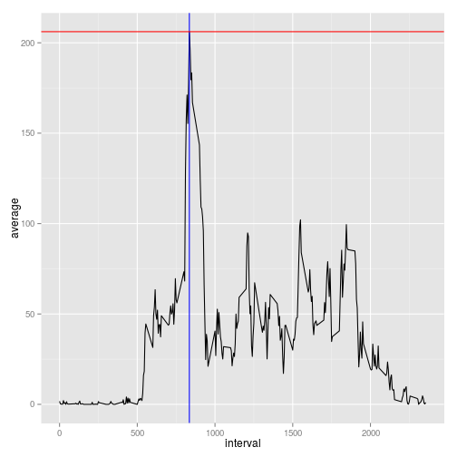

## Loading and preprocessing the data

```r
require("knitr")
require('xtable')

dataDir <- "data"
if (!file.exists(dataDir)) {dir.create(dataDir)}
unzip("activity.zip", exdir=dataDir)
activity.df <- read.csv(paste0(dataDir, "/activity.csv"))
activty.head <- xtable(head(activity.df))
print(activty.head, type="html")
```

<!-- html table generated in R 3.1.2 by xtable 1.7-4 package -->
<!-- Tue Feb 10 23:27:07 2015 -->
<table border=1>
<tr> <th>  </th> <th> steps </th> <th> date </th> <th> interval </th>  </tr>
  <tr> <td align="right"> 1 </td> <td align="right">  </td> <td> 2012-10-01 </td> <td align="right">   0 </td> </tr>
  <tr> <td align="right"> 2 </td> <td align="right">  </td> <td> 2012-10-01 </td> <td align="right">   5 </td> </tr>
  <tr> <td align="right"> 3 </td> <td align="right">  </td> <td> 2012-10-01 </td> <td align="right">  10 </td> </tr>
  <tr> <td align="right"> 4 </td> <td align="right">  </td> <td> 2012-10-01 </td> <td align="right">  15 </td> </tr>
  <tr> <td align="right"> 5 </td> <td align="right">  </td> <td> 2012-10-01 </td> <td align="right">  20 </td> </tr>
  <tr> <td align="right"> 6 </td> <td align="right">  </td> <td> 2012-10-01 </td> <td align="right">  25 </td> </tr>
   </table>


## What is mean total number of steps taken per day?

We remove rows without steps.

```r
require("data.table")
require("ggplot2")
activity.dt <- as.data.table(activity.df)
steps <- activity.dt[!is.na(steps),.(number=sum(steps)),by=date]

mean(steps$number)
```

```
## [1] 10766.19
```

```r
steps.median <- median(steps$number)

steps.gg1 <- ggplot(steps, aes(x=number))
steps.gg1+geom_histogram(binwidth = 850) + geom_vline(xintercept = steps.median, colour = "red")
```

 

```r
steps.gg2 <- ggplot(steps, aes(x=factor(0),y=number))
steps.gg2 + geom_boxplot()+coord_flip()
```

 


## What is the average daily activity pattern?


```r
steps2 <- activity.dt[,.(average=mean(steps, na.rm=TRUE)),by=interval]


interval.max <- steps2[which.max(steps2[,average]),interval]
average.max <- steps2[which.max(steps2[,average]),average]

ggplot(steps2, aes(x=interval, y=average))+geom_line()+
    geom_vline(xintercept=interval.max, colour="red")+
        geom_hline(yintercept=average.max, colour="red")
```

 
## Imputing missing values


```r
sum(activity.dt[,is.na(steps)])
```

```
## [1] 2304
```

```r
sum(activity.dt[,is.na(interval)])
```

```
## [1] 0
```

```r
sum(activity.dt[,is.na(date)])
```

```
## [1] 0
```

## Are there differences in activity patterns between weekdays and weekends?
