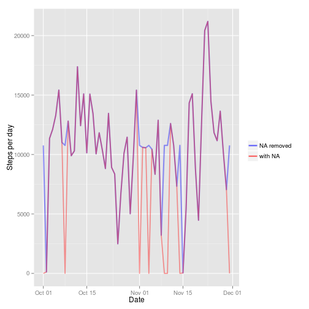

Date format:

```r
Sys.setlocale("LC_TIME", 'en_US.UTF-8')
```

```
## [1] "en_US.UTF-8"
```

## Loading and preprocessing the data

```r
require("knitr")
require('xtable')
```

```
## Loading required package: xtable
```

```r
dataDir <- "data"
if (!file.exists(dataDir)) {dir.create(dataDir)}
unzip("activity.zip", exdir=dataDir)
activity.df <- read.csv(paste0(dataDir, "/activity.csv"))
activty.head <- xtable(head(activity.df))
print(activty.head, type="html")
```

<!-- html table generated in R 3.1.2 by xtable 1.7-4 package -->
<!-- Thu Feb 12 23:48:04 2015 -->
<table border=1>
<tr> <th>  </th> <th> steps </th> <th> date </th> <th> interval </th>  </tr>
  <tr> <td align="right"> 1 </td> <td align="right">  </td> <td> 2012-10-01 </td> <td align="right">   0 </td> </tr>
  <tr> <td align="right"> 2 </td> <td align="right">  </td> <td> 2012-10-01 </td> <td align="right">   5 </td> </tr>
  <tr> <td align="right"> 3 </td> <td align="right">  </td> <td> 2012-10-01 </td> <td align="right">  10 </td> </tr>
  <tr> <td align="right"> 4 </td> <td align="right">  </td> <td> 2012-10-01 </td> <td align="right">  15 </td> </tr>
  <tr> <td align="right"> 5 </td> <td align="right">  </td> <td> 2012-10-01 </td> <td align="right">  20 </td> </tr>
  <tr> <td align="right"> 6 </td> <td align="right">  </td> <td> 2012-10-01 </td> <td align="right">  25 </td> </tr>
   </table>


## What is mean total number of steps taken per day?

We remove rows without steps.

```r
require("data.table")
```

```
## Loading required package: data.table
## data.table 1.9.4  For help type: ?data.table
## *** NB: by=.EACHI is now explicit. See README to restore previous behaviour.
```

```r
require("ggplot2")
```

```
## Loading required package: ggplot2
```

```r
activity.dt <- as.data.table(activity.df)
steps <- activity.dt[!is.na(steps),.(number=sum(steps)),by=date]

mean(steps$number)
```

```
## [1] 10766.19
```

```r
steps.median <- median(steps$number)

steps.gg1 <- ggplot(steps, aes(x=number))
steps.gg1+geom_histogram(binwidth = 850) + geom_vline(xintercept = steps.median, colour = "red")
```

 

```r
steps.gg2 <- ggplot(steps, aes(x=factor(0),y=number))
steps.gg2 + geom_boxplot()+coord_flip()
```

 


## What is the average daily activity pattern?


```r
steps2 <- activity.dt[,.(average=mean(steps, na.rm=TRUE),median=median(steps, na.rm=TRUE)),by=interval]


interval.max <- steps2[which.max(steps2[,average]),interval]
average.max <- steps2[which.max(steps2[,average]),average]

ggplot(steps2, aes(x=interval, y=average))+geom_line()+
    geom_vline(xintercept=interval.max, colour="red")+
        geom_hline(yintercept=average.max, colour="red")
```

 

```r
#geom_line(aes(x=interval, y=median), colour="blue")

ggplot(steps2, aes(x=interval, y=median))+geom_line()
```

 
## Imputing missing values


```r
sum(activity.dt[,is.na(steps)])
```

```
## [1] 2304
```

```r
sum(activity.dt[,is.na(interval)])
```

```
## [1] 0
```

```r
sum(activity.dt[,is.na(date)])
```

```
## [1] 0
```

In order to clone we wrap by data.table


```r
activity.nona <- data.table(activity.dt)

steps.average <- function(int) {
  steps2[interval == int,average]
}

activity.nona[,steps := ifelse(is.na(steps), steps.average(interval), steps)]
```

```
##            steps       date interval
##     1: 1.7169811 2012-10-01        0
##     2: 0.3396226 2012-10-01        5
##     3: 0.1320755 2012-10-01       10
##     4: 0.1509434 2012-10-01       15
##     5: 0.0754717 2012-10-01       20
##    ---                              
## 17564: 4.6981132 2012-11-30     2335
## 17565: 3.3018868 2012-11-30     2340
## 17566: 0.6415094 2012-11-30     2345
## 17567: 0.2264151 2012-11-30     2350
## 17568: 1.0754717 2012-11-30     2355
```

```r
steps.total.per.day <- activity.dt[,.(total=sum(steps, na.rm=TRUE)), by=date]
steps.total.per.day.nona <- activity.nona[,.(total=sum(steps)), by=date]
ggplot(steps.total.per.day)+geom_histogram(aes(x=total),binwidth=1000)
```

 

```r
#qplot(total, data=steps.total.per.day, binwidth=1000)
ggplot(steps.total.per.day)+
    geom_line(aes(as.Date(date),steps.total.per.day.nona$total), color="blue")+
        geom_line(aes(as.Date(date), total), color="red")
```

 

```r
steps.average.per.day <- activity.nona[,.(average=mean(steps)), by=date]
steps.median.per.day <- activity.nona[,.(median=median(steps)), by=date]
```

## Are there differences in activity patterns between weekdays and weekends?


```r
activity.nona[,day:=as.factor(
                   ifelse(
                       (weekdays(as.Date(date)) %in% c("Saturday","Sunday")),
                       "weekend","weekday"))
              ]
```

```
##            steps       date interval     day
##     1: 1.7169811 2012-10-01        0 weekday
##     2: 0.3396226 2012-10-01        5 weekday
##     3: 0.1320755 2012-10-01       10 weekday
##     4: 0.1509434 2012-10-01       15 weekday
##     5: 0.0754717 2012-10-01       20 weekday
##    ---                                      
## 17564: 4.6981132 2012-11-30     2335 weekday
## 17565: 3.3018868 2012-11-30     2340 weekday
## 17566: 0.6415094 2012-11-30     2345 weekday
## 17567: 0.2264151 2012-11-30     2350 weekday
## 17568: 1.0754717 2012-11-30     2355 weekday
```

```r
steps3 <- activity.nona[,.(average=mean(steps, na.rm=TRUE)),
                        by=.(interval, day)]
ggplot(steps3, aes(x=interval, y = average)) + geom_line()+facet_grid(day ~ .)
```

 
